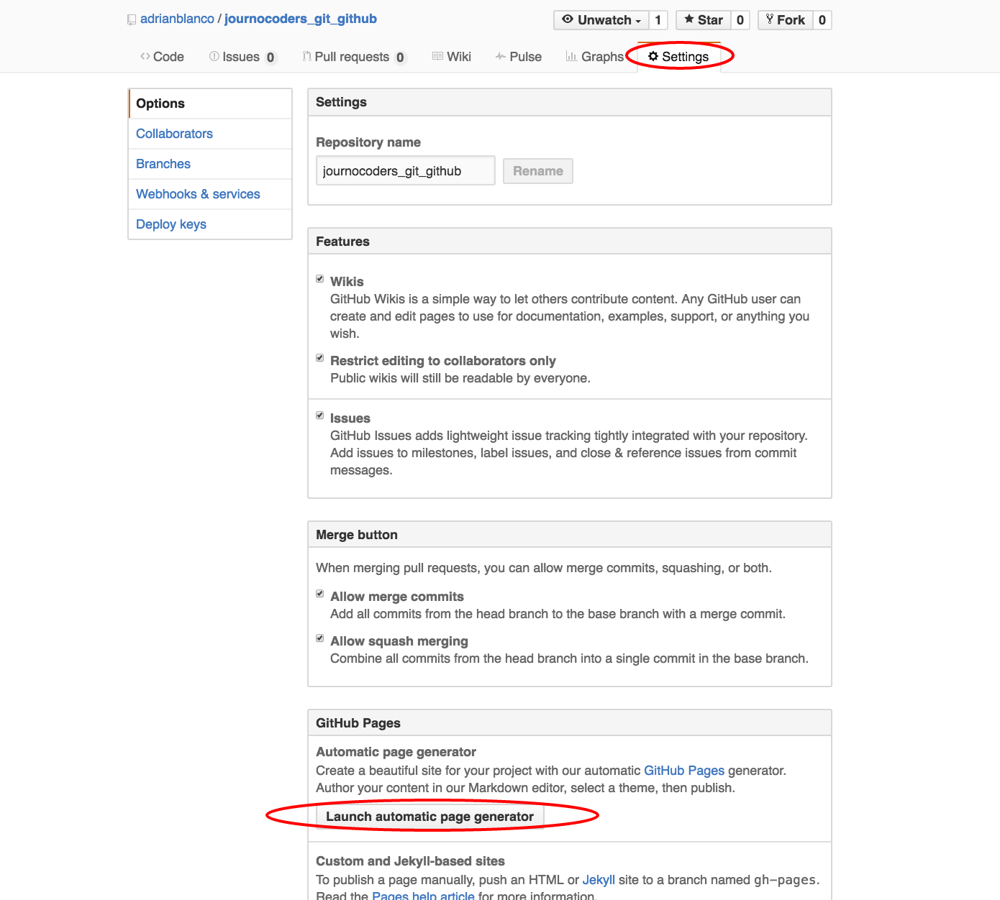

## ¿Qué es Git?

Git es un software de control de versiones diseñado por Linus Torvalds. Su objetivo persigue la eficacia y el control del mantenimiento de versiones de aplicaciones cuando éstas tienen un gran número de archivos de código fuente.

## ¿Quéeee?

Es un sistema que nos permite alojar nuestro código y controlar los códigos que hacemos en él.

- Si has tenido que recurrir a la segunda explicación, ve a la parte del tutorial de GitHub.

- Si ya tienes una cuenta, y has trabajado antes con Git y Github, aprende a utilizar la terminal.

- Si quieres aprender a crear tu propia página con GitHub Pages ve al final de este tutorial

## Instala Git

- Windows: Recomendado: bajar GitHub for Windows, que incluye Git: windows.github.com. 
- Mac: You can also download GitHub for Mac, which includes Git, mac.github.com (from Preferences, select the command line tools install), or
download Git by itself at: git-scm.com/downloads and follow the installation instructions.

Git no es un aplicación como cualquier otra de tu ordenador. No la verás, pero podrás trabajar con ella a través de la terminal. Sí puedes ver GitHub para Windows o Mac, aunque

## ¿Lo he instalado correctamente?

Una vez instalado, abre la terminal (Bash, Shell, Prompt). Verifica que lo has instalado correctamente:

	$ git --version

La terminal te devolverá la versión, algo así:
git version 1.9.1
(Any version 1.7.10 or higher is fine.)

## Configura tu nombre y correo

Ya puedes configurar Git para poder realizar cambios en tus proyectos:

Introduce tu nombre:

	$ git config --global user.name "Tu nombre"

Ahora, tu email:

	$ git config --global user.email "<youremail@example.com>"

## Crea un repositorio

Vas a crear tu primer repositorio. Puedes llamarlo como quieras. En este tutorial lo llamaremos ‘mi-primer-repo’.

Para crear un repositorio, introduce:

	$ mkdir mi-primer-repo

(Ten en cuenta dentro de qué carpeta te encuentras)
Para ir a ese repositorio:

	$ cd hello-world

To create a new Git instance for a project:

	$ git init

That's it! It will just return you to a new line. If you want to be double-sure that it's a Git repository, type git status and if it doesn't return 'fatal: Not a git repository...', you're golden!

## Crea un archivo nuevo

Una vez que has creado tu primer repositorio, ya puedes añadir nuevos archivos.
Abre un editor de textos (Atom, Sublime…). Escribe unas líneas de texto. Lo que quieras. Guarda el archivo como readme.txt en el repo ‘mi-primer-repo’.

## Estado del repo, añade y actualiza los cambios

Si quieres comprobar el estado de tu repositorio para comprobar si ha habido cambios, entra en ‘mi-primer-repo’. (Recuerda utilizar el comando cd para moverte por la consola). Para ver si ha habido cambios, introduce:

	$ git status

## Añade el archivo	
Cuando ya has hecho la comprobación necesario, puedes añadir el archivo que antes has guardado como ‘readme.txt’. Para ello, escribe en la consola:

	$ git add readme.txt

## Mi primer commit	

Por último, añade esos cambios (commit) al historial del repositorio con una breve descripción de los cambios:

	$ git commit -m "<descripción>"

## Comprueba los cambios entre commits

Si realizas más cambios en el archivo readme.txt y los guardas, puedes comprobar las diferencias entre los diferentes commits mediante el siguiente comando:

	$ git diff

## Para profundizar:

Hemos cubierto las acciones fundamentales para trabajar con Git desde la consola.
Los siguientes pasos fundamentales cosnsisnten en aprender a ejecutar las siguientes acciones desde la consola:

- Pull
- Push
- Fork 

Puedes guiarte con este tutorial de [Adolfo Antón](https://github.com/flowsta/github/blob/master/README.md) o seguir con estos retos que propone [Jlord] (http://jlord.us/git-it/challenges/remote_control.html).
Si quieres tener una chuleta en papel de los comandos que puedes utilizar puedes imprimir esta hoja de referencia que ha preparado [GitHub] (https://training.github.com/kit/downloads/es_ES/github-git-cheat-sheet.pdf)

# Si no te sientes cómodo con la Terminal…

Aunque lo ideal es trabajar con la Terminal, si no te sientes cómo con los comanados puedes iniciarte en Github a través de su versión web. Es mucho más limitada y menos potente, pero te ayudará a tener una visión global de qué es Git y Github.

Ve a [GitHub] (https://github.com/) y crea una cuenta. Ahora explicaremos las opciones fundamentales que ofrece la web de GitHub.

# Cómo crear tu propia web con gh-pages

- Crea un repositorio

- Dale un nombre

- Puedes añadirle un .ReadMe

- Ve a Settings

- Pincha en 'Launch automatic page generator'

- En Body, puedes cambiar tu descripción

- OJO, no es HTML, tendrás que usar lenguaje [Markdown] (https://daringfireball.net/projects/markdown/syntax). Aquí tienes otra [chuleta] (https://github.com/adam-p/markdown-here/wiki/Markdown-Cheatsheet).

- Selecciona una plantilla

- Luego podrás modificar tanto .html como .css

- Publica tu página en “Publish page”

### Más info sobre GitHub Pages

Puedes echar un vistazo a [las diferentes posibilades] (https://pages.github.com/) que ofrece GitHub Pages. Gracias a Bootstrap o Jekyll puedes crear páginas web mucho más completas.

